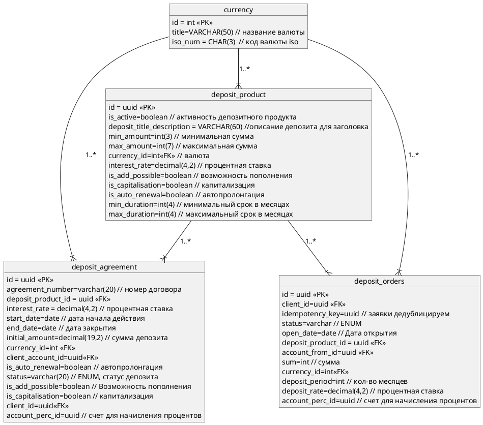

# ERD

```plantuml

@startuml
object deposit_product  {
id = uuid <<PK>>              
is_active=boolean // активность депозитного продукта     
deposit_title_description = VARCHAR(60) //описание депозита для заголовка
min_amount=int(3) // минимальная сумма
max_amount=int(7) // максимальная сумма
currency_id=int<<FK>> // валюта
interest_rate=decimal(4,2) // процентная ставка
is_add_possible=boolean // возможность пополнения
is_capitalisation=boolean // капитализация
is_auto_renewal=boolean // автопролонгация
min_duration=int(4) // минимальный срок в месяцах 
max_duration=int(4) // максимальный срок в месяцах
}
 
object currency  {
id = int <<PK>>             
title=VARCHAR(50) // название валюты 
iso_num = CHAR(3)  // код валюты iso
}

 
object deposit_agreement {
id = uuid <<PK>>              
agreement_number=varchar(20) // номер договора
deposit_product_id = uuid <<FK>> 
interest_rate = decimal(4,2) // процентная ставка
start_date=date // дата начала действия
end_date=date // дата закрытия
initial_amount=decimal(19,2) // сумма депозита
currency_id=int <<FK>> 
client_account_id=uuid<<FK>>      
is_auto_renewal=boolean // автопролонгация
status=varchar(20) // ENUM, статус депозита
is_add_possible=boolean // Возможность пополнения
is_capitalisation=boolean // капитализация
client_id=uuid<<FK>>  
account_perc_id=uuid // счет для начисления процентов
}
 
object deposit_orders {
id = uuid <<PK>>               
client_id=uuid <<FK>>  
idempotency_key=uuid // заявки дедублицируем
status=varchar // ENUM
open_date=date // Дата открытия
deposit_product_id = uuid <<FK>>  
account_from_id=uuid <<FK>>  
sum=int // сумма
currency_id=int<<FK>>      
deposit_period=int // кол-во месяцев
deposit_rate=decimal(4,2) // процентная ставка
account_perc_id=uuid // счет для начисления процентов   
}
 


currency --|{ deposit_agreement : "1..*"
currency --|{ deposit_product : "1..*"
currency --|{ deposit_orders : "1..*"
deposit_product --|{deposit_agreement: "1..*"
deposit_product --|{deposit_orders: "1..*"

```

