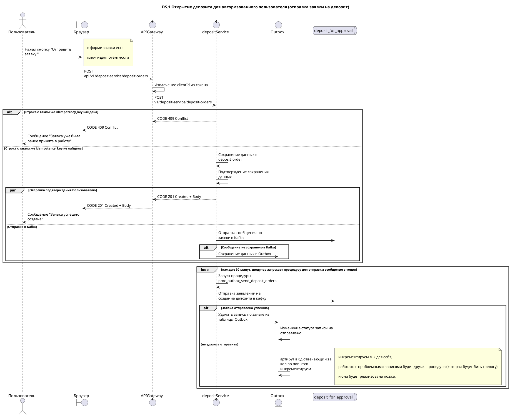

# DS-1 - Создание заявки на депозит

Примечание:

Мы должны подтверждать депозитные заявки, аналогично процессу в Белгазпромбанке. Депозит не создается немедленно при оформлении; подтверждение происходит в будние дни и в рабочее время. Без подтверждения от сотрудников депозиты не предоставляются.

Может показаться, что процесс не полностью описан, но это описание первой точки входа для создания заявки на депозит. Дальнейшие шаги будут разработаны в последующих спринтах.

Паттерн Outbox для Kafka включает сохранение сообщений в лестнице (Outbox) перед их публикацией в тему Kafka. Этот метод гарантирует сохранность сообщений в случае сбоя процесса публикации и обеспечивает доставку сообщений.

